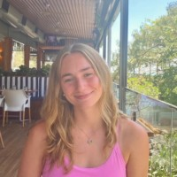

```{r setup_index, include=FALSE}
knitr::opts_chunk$set(echo = FALSE)
```

# Hello!

I'm Ansleigh! Welcome to my personal site. This homepage is written in **R Markdown** and will be published on **GitHub Pages**.

- I am interested in: _conservation biology, community engagement, and really good books_.
- This site will grow as I add more `.Rmd` analyses under **Analyses**.

```{r echo=FALSE, out.width='300px'}

```
